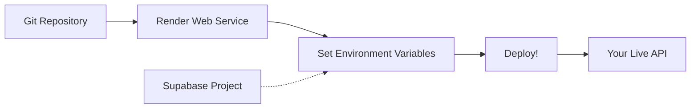

# 📰 News API - FastAPI + Supabase

<div align="center">


[](https://render.com)
[](https://www.python.org/)
[](https://opensource.org/licenses/MIT)

**A powerful and scalable News API built with FastAPI and Supabase - deploy in minutes!**

[✨ Features](#-features) •
[🚀 Local Setup](#-local-development) •
[🌐 Deploy to Render](#-how-to-deploy-on-render) •
[🔧 Troubleshooting](#-troubleshooting) •
[📝 API Docs](#-api-documentation)

</div>

---

## ✨ Features

| | Feature | Description |
|--|---------|-------------|
| ⚡ | **FastAPI** | High performance, automatic OpenAPI docs |
| 🔐 | **Supabase Auth** | Secure authentication ready |
| 🗄️ | **PostgreSQL** | Robust database with real-time capabilities |
| 🚀 | **Render Ready** | One-click deployment configuration |
| 📊 | **Auto Documentation** | Interactive Swagger UI |
| 🔄 | **Auto-reload** | Hot reload for development |

---

## 🚀 Local Development

### 📋 Prerequisites

- Python 3.9+
- Supabase account (free tier works!)
- pip (Python package manager)

### ⚡ Quick Start

```bash
# 1. Clone the repository
git clone https://github.com/yourusername/news-api.git
cd news-api

# 2. Install dependencies
pip install -r requirements.txt

# 3. Start the server
uvicorn main:app --reload --port 8000
```

🎉 **Your API is now running at** `http://localhost:8000`

### 📚 API Documentation

Once running, access the interactive documentation:

| Documentation | URL |
|--------------|-----|
| **Swagger UI** | `http://localhost:8000/docs` |
| **ReDoc** | `http://localhost:8000/redoc` |
| **OpenAPI JSON** | `http://localhost:8000/openapi.json` |

---

## 🌐 How to Deploy on Render

### 📋 Prerequisites

| Required | Why |
|----------|-----|
| [Render Account](https://render.com) (free) | Hosting platform |
| [Supabase Account](https://supabase.com) (free) | Database & Auth |
| Git Repository (GitHub/GitLab/Bitbucket) | Source code management |

### 🚦 Deployment Roadmap



### 📦 Repository Requirements

Make sure your repository includes:

```
📁 news-api/
├── 📝 main.py              # Application code
├── 📦 requirements.txt     # Dependencies
├── 📄 README.md           # Documentation
└── 🔒 .env.example        # Environment template (optional)
```

### 🎯 Step-by-Step Deployment

#### **Step 1: Prepare Your Repository**

```bash
# Make sure requirements.txt includes:
echo "fastapi
uvicorn
supabase
python-dotenv" > requirements.txt
```

#### **Step 2: Create Web Service on Render**

1. Go to [Render Dashboard](https://dashboard.render.com)
2. Click **"New +"** → **"Web Service"**
3. Connect your Git repository
4. Select your `news-api` repository

#### **Step 3: Configure Your Service**

| Setting | Value |
|---------|-------|
| **Name** | `news-api` (or your preferred name) |
| **Region** | Choose closest to you (e.g., `Oregon`) |
| **Branch** | `main` |
| **Runtime** | `Python 3` |
| **Build Command** | `pip install -r requirements.txt` |
| **Start Command** | `uvicorn main:app --host 0.0.0.0 --port $PORT` |

#### **Step 4: Add Environment Variables**

In the **Environment Variables** section, add:

```env
SUPABASE_URL=your_supabase_project_url
SUPABASE_ANON_KEY=your_supabase_anon_key
TABLE_NEWS=news
```

<details>
<summary>📌 How to get Supabase credentials</summary>

1. Log in to [Supabase Dashboard](https://app.supabase.com)
2. Select your project
3. Go to **Settings** → **API**
4. Copy these values:
   - **Project URL** → `SUPABASE_URL`
   - **anon public key** → `SUPABASE_ANON_KEY`


</details>

#### **Step 5: Choose Plan & Deploy**

- Select **Free Plan** to start
- Click **"Create Web Service"**
- ⏱️ First deployment takes 2-3 minutes

#### **Step 6: 🎉 Celebrate!**

Your API is now live at: `https://news-api.onrender.com`

Access your documentation at: `https://news-api.onrender.com/docs`

---

## ⚙️ Advanced Configuration

### 🔄 Auto-Deploy Settings

By default, Render auto-deploys on every push. To customize:

```yaml
# In Render dashboard → Settings → Auto-Deploy
# Options:
# - Yes: Deploy on every push
# - No: Manual deploys only
```

### 🌍 Custom Domain

Want your own domain?

1. Go to **Settings** → **Custom Domain**
2. Add your domain (e.g., `api.newsapp.com`)
3. Update DNS records as instructed
4. Wait for SSL certificate (automatic! ✨)

### 📊 Monitoring & Logs

| Tab | What you'll find |
|-----|------------------|
| **📋 Logs** | Real-time application logs |
| **📈 Metrics** | CPU, Memory, Network usage |
| **📅 Events** | Deployment history |

---

## 🔧 Troubleshooting

### 🐛 Common Issues & Solutions

<details>
<summary><b>❌ "Application failed to start"</b></summary>

**Check:**
- Start command format: `uvicorn main:app --host 0.0.0.0 --port $PORT`
- `main:app` matches your file and app variable name
- All environment variables are set

**Quick fix:**
```bash
# Test locally with same command
uvicorn main:app --host 0.0.0.0 --port 8000
```
</details>

<details>
<summary><b>❌ "RuntimeError: Configure SUPABASE_URL and SUPABASE_ANON_KEY"</b></summary>

**Problem:** Missing environment variables  
**Solution:** Add both variables in Render dashboard

```env
SUPABASE_URL=https://your-project.supabase.co
SUPABASE_ANON_KEY=eyJhbGciOiJIUzI1NiIsInR5cCI6IkpXVCJ9...
```
</details>

<details>
<summary><b>❌ "Application is spinning down" (Free Plan)</b></summary>

**Why:** Free tier spins down after 15 minutes of inactivity  
**Solution:** 
- First request after inactivity takes ~30 seconds (cold start)
- Consider upgrading to paid plan for production
- Use a [cron job](https://cron-job.org) to ping your API every 10 minutes
</details>

### 📊 Free Plan Limits

| Resource | Limit |
|----------|-------|
| **Hours/month** | 750 hours (~31 days) |
| **Bandwidth** | 100 GB/month |
| **Spin-down** | After 15 min inactivity |
| **Cold start** | ~30 seconds |

---

## 📝 API Documentation

### Interactive Documentation

Once deployed, access:

```bash
# Swagger UI (interactive)
https://your-api.onrender.com/docs

# ReDoc (alternative)
https://your-api.onrender.com/redoc

# OpenAPI JSON
https://your-api.onrender.com/openapi.json
```

### Example Endpoints

| Method | Endpoint | Description |
|--------|----------|-------------|
| `GET` | `/` | Welcome message |
| `GET` | `/health` | Health check |
| `GET` | `/news` | List all news |
| `GET` | `/news/{id}` | Get specific news |
| `POST` | `/news` | Create news |
| `PUT` | `/news/{id}` | Update news |
| `DELETE` | `/news/{id}` | Delete news |

---

## 🚦 Status Badges

| Service | Status |
|---------|--------|
| **API Status** |  |
| **Deployment** |  |
| **Database** |  |
| **Uptime** |  |

---

## 💡 Pro Tips

1. **🌙 Wake up your API**: Use a cron job to ping `/health` every 10 minutes
2. **🔒 Secure your keys**: Never commit `.env` file
3. **📦 Dependency management**: Pin your versions in `requirements.txt`
4. **🔄 Version your API**: Use `/v1/news` for future-proofing
5. **📊 Monitor usage**: Check Render dashboard metrics weekly

---

## 🤝 Contributing

Found a bug? Have an idea? Contributions are welcome!

1. 🍴 Fork the repository
2. 🌿 Create a feature branch
3. 🔧 Make your changes
4. ✅ Test locally
5. 📤 Submit a PR

---

## 📄 License

This project is licensed under the MIT License - see the [LICENSE](LICENSE) file for details.

---

<div align="center">

### ⭐ Show your support

If this guide helped you deploy your News API, give it a star!

**Happy coding! 🚀**

</div>
